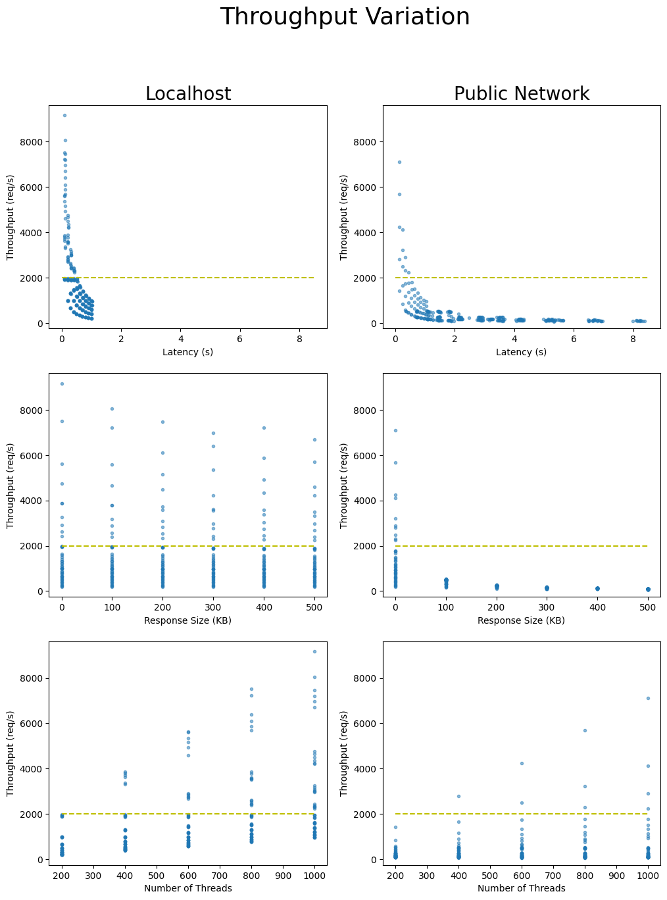
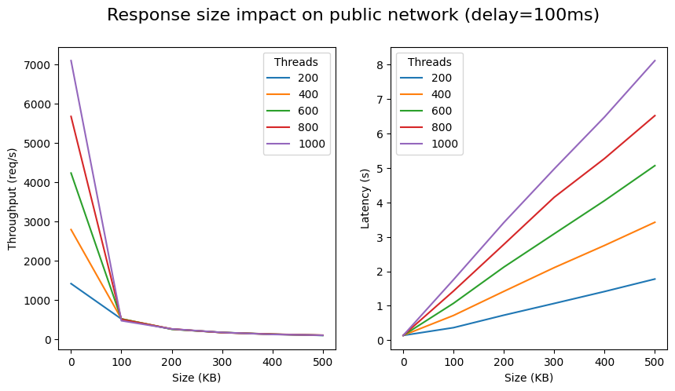

# Golang HTTP Client Benchmark

> ⚠️ Running the benchmark can be expensive it you paye egress traffic on your cloud provider. Be sure to check the costs before running the benchmark.

This repository contains measurements and analysis of the performance of the Golang HTTP client from the standard library.

The goal of this benchmark is not to compare the performance of `http.Client` to other HTTP clients, but to measure under which conditions—in terms of latency, response size and network quality—the http.Client can perform at a **sustained throughput of 2000 requests per second**. This number was chosen as a target for the backlink-engine crawler, which needs to process 
1,000,000,000 page per week.

## Methodology

We use the load tester [hey](https://github.com/rakyll/hey) as the reference implementation of a program that uses `http.Client` to send requests to a server. We also use it's output to
measure the throughput and latency of the requests.

As a server, we use the simple mock-server described in `main.go`. It's based on `http.Server` from the standard library and can be configured to control the latency and the size of the response.

We run the benchmark using a bash script that runs `hey` and the server with different parameters and collects the results in a CSV file.

The benchmark is run in 3 network configurations:
- **Localhost**: The server and the client are running on the same machine.
- **Public Network**: The client is running on a laptop and the server is running on an AWS EC2 instance.

The following hardware was use during the benchmark:
- **Laptop (localhost)**:Dell Swift X14, i7-13700H (20 thread), 32GB RAM, Fedora 41 Workstation
- **Server**: AWS EC2 c5.4xlarge, 16 vCPU, 32GB RAM, Amazon Linux 2

I choosed the c5.4xlarge instance the be sure that the server would not be the bottleneck of the benchmark.

## Results

The throuhput behave differently depending on the network configuration, specifically the
size of the response has near none effect on the throughput when running on localhost, but has a significant effect when running on a public network. The latency has an inverse effect on the throughput, the higher the latency the lower the throughput, this is exepected. On the public network the size of the response has a big impact on latency, and thus on the throughput, this effect is much higher than than expected and probably is the main reason for the lower throughput on the public network.

On the last graph (throuhput vs size) we can clearly see a bottleneck as soon as the response size is 100KB, this is rather sooner than expected. Next measurement (batch 3) will focus on lower response size to see exactly where the bottleneck start. 
