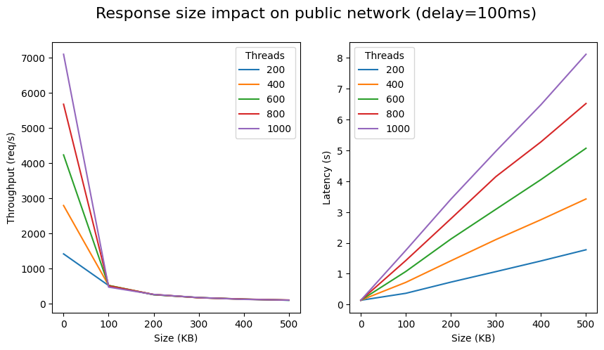
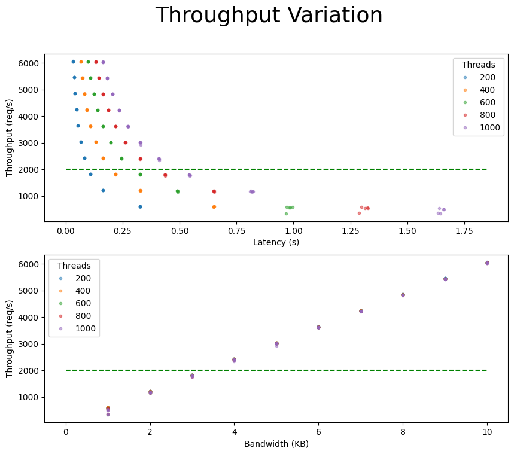

# Golang HTTP Client Benchmark

This repository contains measurements and analysis of the performance of the Golang HTTP client from the standard library.

The goal of this benchmark is not to compare the performance of `http.Client` to other HTTP clients, but to measure under which conditions—in terms of latency, response size and network quality—the http.Client can perform at a **sustained throughput of 2000 requests per second**. This number was chosen as a target for the backlink-engine crawler, which needs to process about a billion pages per week.

## Methodology

We use the load tester [hey](https://github.com/rakyll/hey) as the reference implementation of a program that uses `http.Client` to send requests to a server. We also use it's output to
measure the throughput and latency of the requests.

As a server, we use the simple mock-server described in `main.go`. It's based on `http.Server` from the standard library and can be configured to control the latency and the size of the response.

We run the benchmark using a bash script that runs `hey` and the server with different parameters and collects the results in a CSV file.

### Batch 1 and 2

The benchmark is run in 2 network configurations:
- **Localhost**: The server and the client are running on the same machine.
- **Public Network**: The client is running on a laptop and the server is running on an AWS EC2 instance.

The following hardware was use during the benchmark:
- **Laptop (localhost)**:Dell Swift X14, i7-13700H (20 thread), 32GB RAM, Fedora 41 Workstation
- **Server**: AWS EC2 c5.4xlarge, 16 vCPU, 32GB RAM, Amazon Linux 2

I choosed the c5.4xlarge instance the be sure that the server would not be the bottleneck of the benchmark.

### Batch 3

As first and second benchark shown a bottleneck on bandwidth, I decided to run a third batch of tests with:
- smaller response size. The goal is to find the exact point where the bottleneck start.
- higher bandwidth to see if the bottleneck can be overcome with higher-end networking

I used the following GCP instance type for testing:
- **Server**:  c4-standard-8 (8 vCPU, 30 Go memory), Debian 12
- **Client-10Gbit/s**: c4-standard-2 (2 vCPU, 7Go memory), Debian 12
- **Client-23Gbit/s**: c4-standard-4 (4 vCPU, 15Go memory), Debian 12

### Batch 4

For the forth batch I wanted more control over the network configuration than just the 
choice of VM type. I decided to 
us [tc](https://man7.org/linux/man-pages/man8/tc.8.html) [(Linux Traffic Controle)](https://docs.redhat.com/en/documentation/red_hat_enterprise_linux/8/html/configuring_and_managing_networking/linux-traffic-control_configuring-and-managing-networking)
to vary the latency and the bandwidth of the network. In this configuration we fix the
response size to 200KB.

## Results

The batch 1 and 2 showed that bandwidth of the network is the primary bottleneck of the
the throughput. This was expected but the bottleneck was reached at a much lower throughput than expected. The following graph shows the results of the benchmark:

We can clearly see a bottleneck as soon as the response size is 100KB, this is rather sooner than expected.

For batch 3 and 4 we focused on varying the latency and the bandwidth of the network. The following graph shows the results of the benchmark:

This shows that at least ~3Gbit/s of bandwidth is needed to reach a throughput of 2000 requests per second.

Of course all of those measurements where realized in "laboratory" conditions with a uniform
set of request. In real condition there is going to be a lot more variability on all the parameters.
Regardless, this test demonstrate that 2000req/s is a reasonable target as long as you have
access to 10Gbit/s network and the average response size is not too big. 
